# Simulation State Machine

The symbols used herin are as follows:

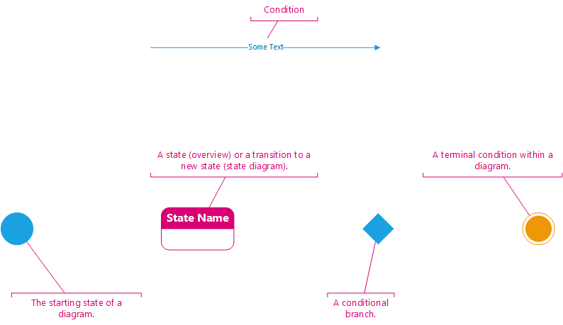

## High Level Overview

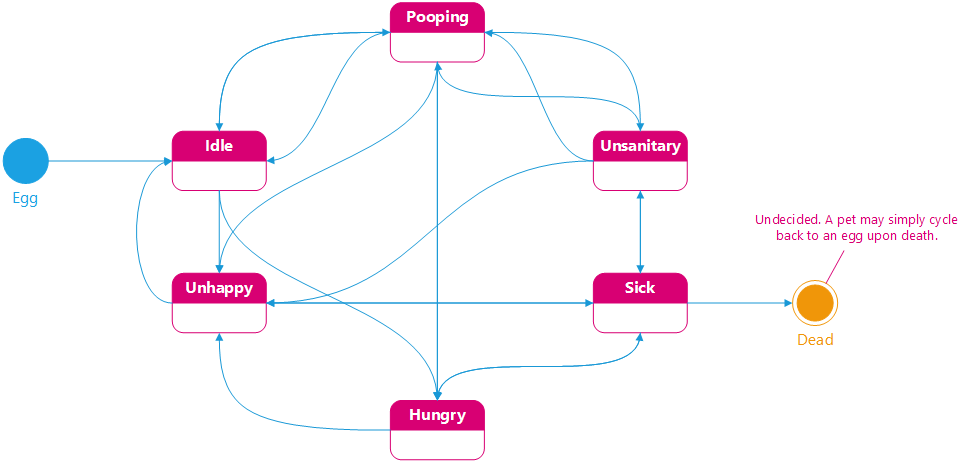

## Priority

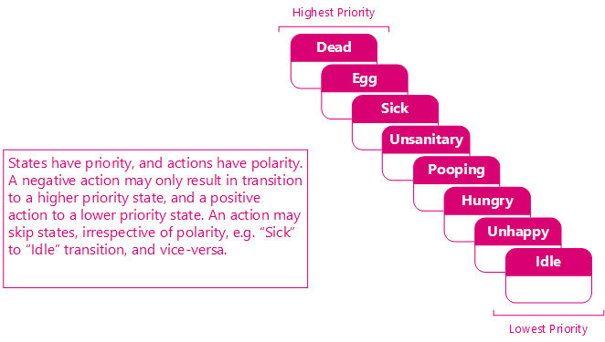

## Lifecycle Matrix

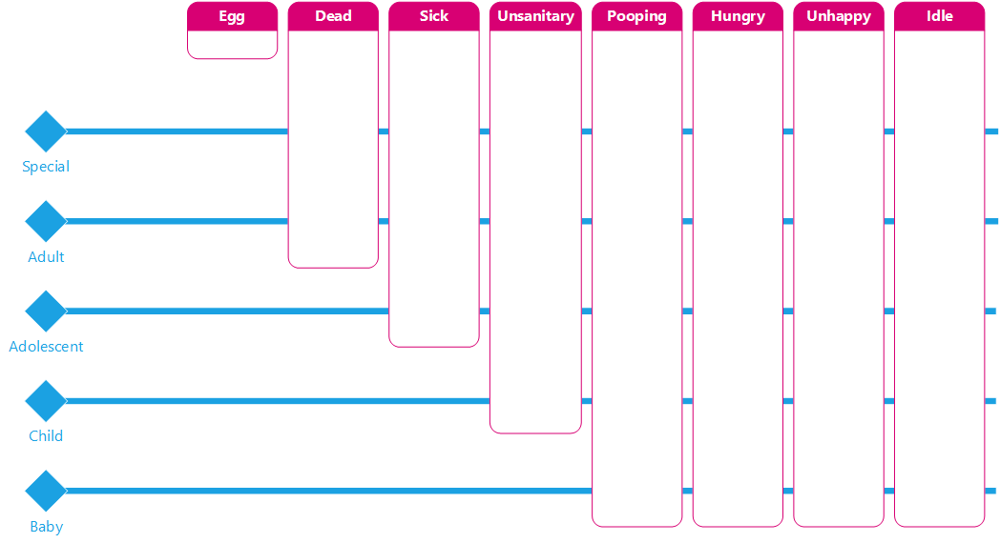

## State Interactions

### Egg

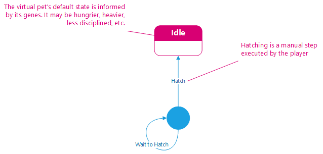

### Idle

### Unhappy

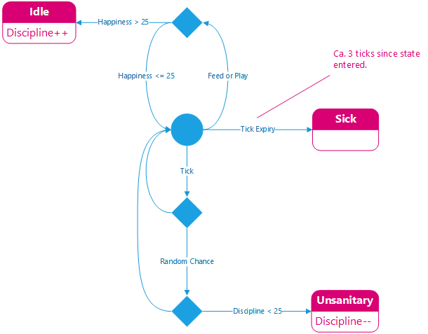

### Hungry

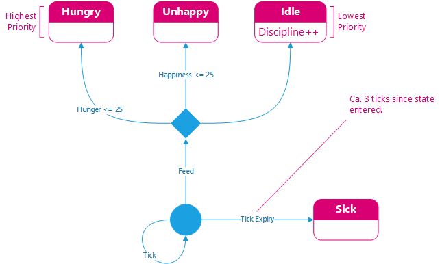

### Pooping

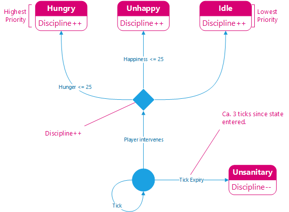

### Unsanitary

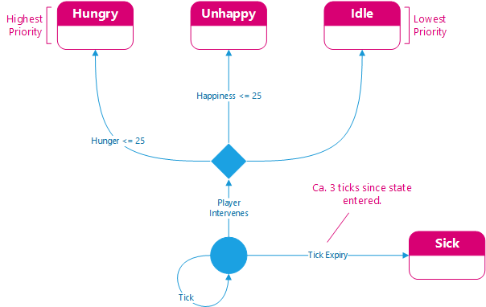

### Sick

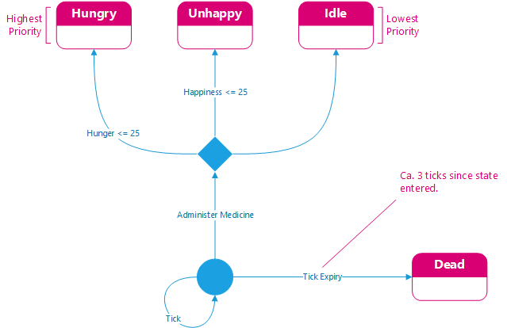

### Dead

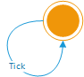
