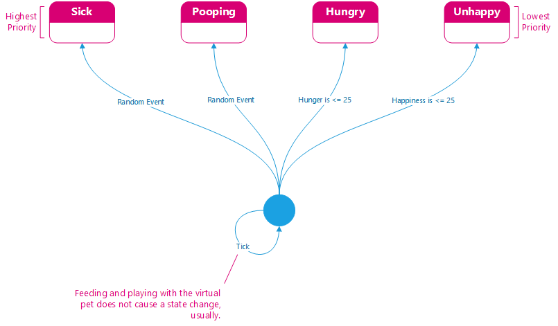

# Simulation State Machine

The symbols used herin are as follows:

## High Level Overview

## Priority

## Lifecycle Matrix

## State Interactions

### Egg

### Idle

### Unhappy

### Hungry

### Pooping

### Unsanitary

### Sick

### Dead

